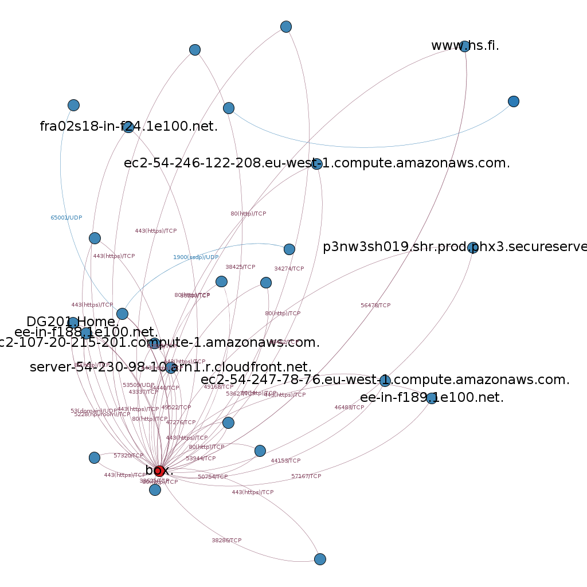

Brassfork
=========

Visualizes network by its traffic. Reads pcap files, and spits out files for graphing with [Gephi](https://gephi.github.io/).

Example result
--------------

Simple graph made with Gephi from resulting data:



Requirements and building
------------

Dependencies (tested with):

* libpcap 1.5+
* go 1.3+

Recommended:

* [Gephi](https://gephi.github.io/)
* [Wireshark](https://www.wireshark.org/)

To build, just use go get and build:

```go
go get "github.com/mikkolehtisalo/brassfork"
go build "github.com/mikkolehtisalo/brassfork"
```

Usage
-----

First capture some network traffic, and save it as pcap file. Then run brassfork:

```sh
./brassfork -in=capture.pcap -edges=edges.csv -nodes=nodes.csv
```

The resulting edge and node files can then be imported to Gephi for graphing.

Attributes
----------

Extra attributes generated for edges:

* Packages: Amount of packages related to edge
* SYNs: Detected SYN packages (attempted new TCP connections)
* FINs: Detected FIN packages (by the initiator)
* Unfinished: For TCP, SYNs-FINs (rough indication to how many connections have not been closed already/properly)
* Bytes: Cumulative counter of bytes transported in IP frames. This is also set as the weight for edges.

Extra attributes generated for nodes:

* Network: Name of the network, based on CIDR network mask (see below)

Network names
-------------

Network names are useful for partitioning data in Gephi. Create a valid JSON file containing information about your known networks. Take a look at *example.json*:

```json
[
  {
    "CIDR": "192.168.1.0/24",
    "Name": "Home network"
  },
  {
    "CIDR": "192.168.2.0/24",
    "Name": "Other network"
  }
]
```

After creating the file run brassfork with the -networks parameter, like

```sh
./brassfork -in=capture.pcap -edges=edges.csv -nodes=nodes.csv -networks=example.json
```

The nodes output should contain the Network information for nodes with matching IP addresses.


